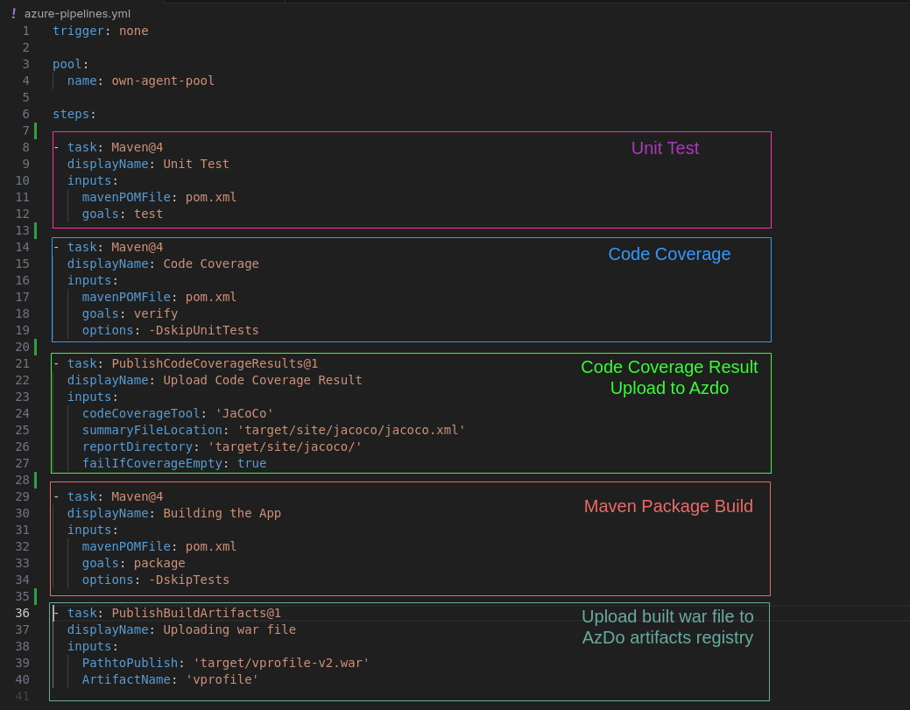
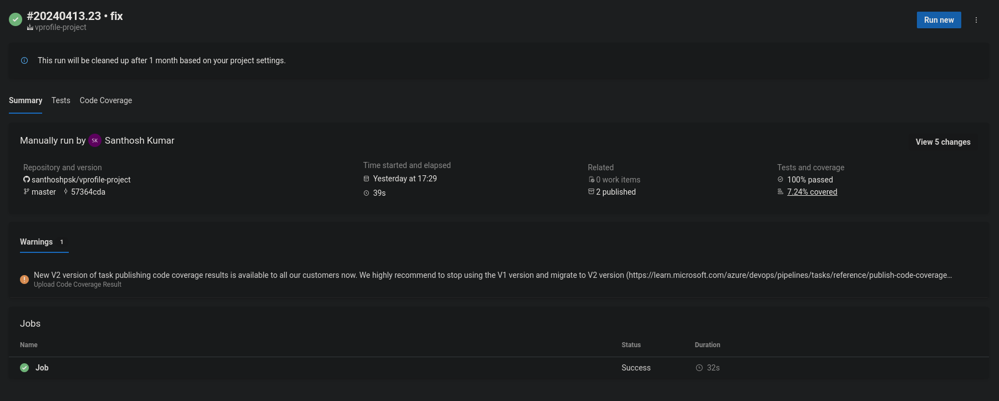
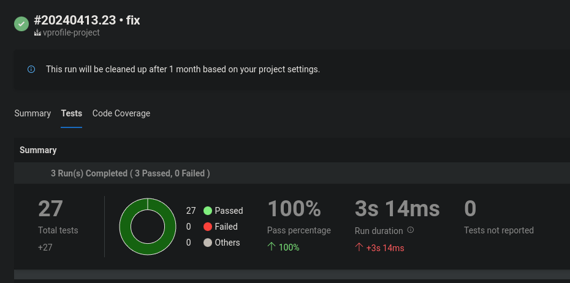
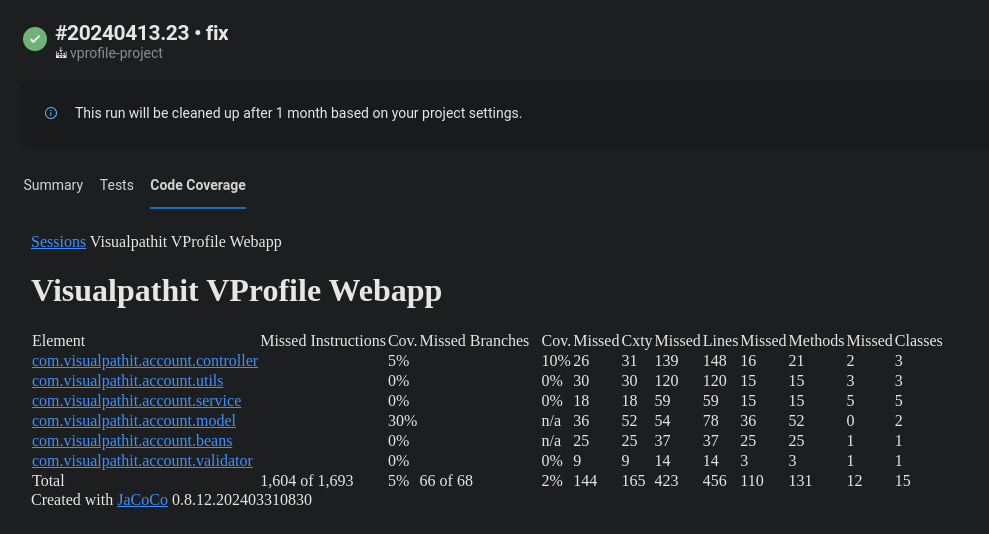
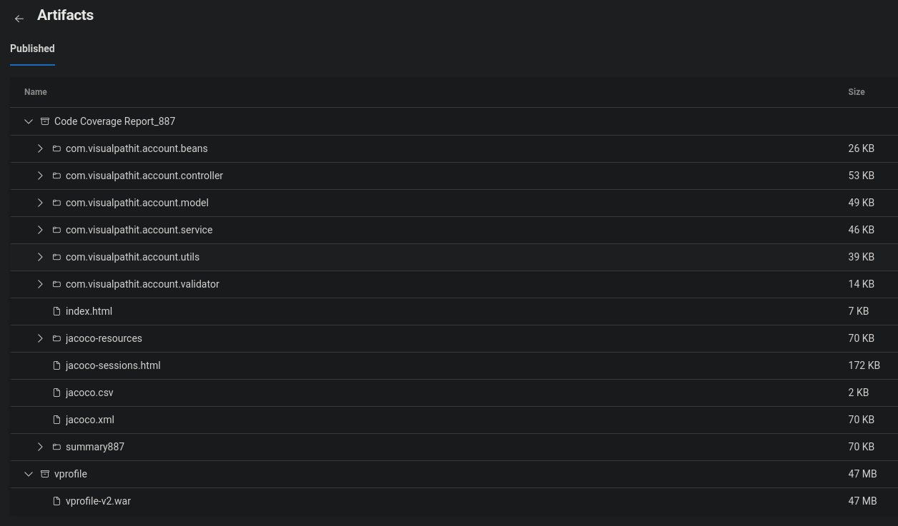

# Azure Devops Setup for Continuous Integration (CI)
Azure devops pipeline is used to build this project.

#

Sample CI execution in AzDo:

#
Application source code forked from: https://github.com/devopshydclub/vprofile-repo